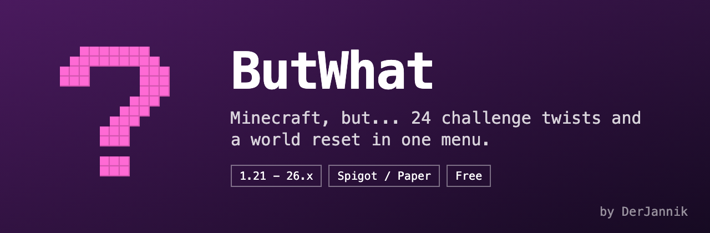

# ButWhat

Minecraft, but... 24 challenge twists and a world reset in one menu.

Free plugin for Spigot and Paper, 1.21 up to 26.x, one jar, no dependencies. Java 21 or newer.

## Download

[SpigotMC](https://www.spigotmc.org/resources/butwhat-24-minecraft-but-challenges-world-reset.139296/) or the [latest GitHub release](../../releases/latest).

## Build

```
gradle build
```

The jar ends up in `delivery/`.

## Custom plugins

Need something built just for your server? [DerJannik on Fiverr](https://de.fiverr.com/s/xXgY29x)
